# LAB 3 - BẢO MẬT MẠNG MÁY TÍNH

## 1. Giới thiệu

Lab 3 gồm hai nội dung chính:

- **SecureChat:** xây dựng ứng dụng chat TCP đa luồng, bảo vệ kết nối bằng TLS và xác thực chứng chỉ hai chiều giữa server và client. Tin nhắn còn được mã hóa ở tầng ứng dụng bằng AES.
- **NetRecon:** xây dựng bộ công cụ trinh sát mạng bằng Python, hỗ trợ quét cổng, nhận dạng dịch vụ, lấy banner, xem bảng ARP, đối chiếu lỗ hổng cơ bản và gửi kết quả qua Gmail SMTP. Công cụ có cả giao diện dòng lệnh và giao diện web Flask.

> Chỉ sử dụng NetRecon với máy tính hoặc hệ thống được cho phép kiểm thử.

## 2. Cấu trúc thư mục

```text
Lab3/
├── README.md
├── image/
│   ├── lab3-1.png ... lab3-16.png      # Hình phần SecureChat
│   └── lab3-19.png ... lab3-46.png     # Hình phần NetRecon
├── secure-chat/
│   ├── certs/
│   │   ├── ca/
│   │   ├── server/
│   │   └── client/
│   ├── client.py
│   ├── connection_manager.py
│   ├── make-certs.bat
│   ├── message_encryption.py
│   ├── openssl.cnf
│   ├── room_manager.py
│   └── server.py
└── netrecon/
    ├── modules/
    │   ├── banner_grabber.py
    │   ├── email_sender.py
    │   ├── filter_utils.py
    │   ├── network_mapper.py
    │   ├── port_scanner.py
    │   ├── service_detector.py
    │   └── vuln_checker.py
    ├── static/style.css
    ├── templates/
    │   ├── index.html
    │   ├── layout.html
    │   └── result.html
    ├── .env                 # Chứa cấu hình SMTP, không đưa lên Git
    ├── .gitignore
    ├── app.py
    ├── cli.py
    └── requirements.txt
```

Các thư mục môi trường ảo `.venv`, file cache `__pycache__` và file log không được liệt kê trong cây thư mục trên.

---

## 3. Phần 1 - SecureChat

### 3.1. Mục tiêu và thành phần

SecureChat chạy tại `127.0.0.1:8443` và gồm các thành phần:

| File | Chức năng |
| --- | --- |
| `message_encryption.py` | Mã hóa/giải mã tin nhắn bằng AES-256-CBC, IV ngẫu nhiên 16 byte và PKCS#7 padding. |
| `connection_manager.py` | Quản lý danh sách client, username và khóa mã hóa bằng cơ chế khóa luồng. |
| `room_manager.py` | Tạo phòng, cho client tham gia/rời phòng và hỗ trợ phát tin trong phòng. |
| `server.py` | Tạo server đa luồng, thiết lập TLS, bắt buộc client certificate và chuyển tiếp tin nhắn. |
| `client.py` | Xác minh chứng chỉ server bằng CA, gửi client certificate và trao đổi tin nhắn đã mã hóa. |

Server yêu cầu **TLS 1.2 trở lên** bằng `ssl.TLSVersion.TLSv1_2`. Trong lần kiểm thử, hai phía thương lượng thành công **TLS 1.3**. Server bắt buộc client cung cấp chứng chỉ hợp lệ (`ssl.CERT_REQUIRED`), còn client dùng CA cục bộ để xác minh chuỗi chứng chỉ của server.

Ở tầng ứng dụng, mỗi client tạo khóa AES 32 byte. Khóa được gửi cho server bên trong kênh TLS; server giải mã tin nhắn rồi mã hóa lại bằng khóa của client nhận. Vì server có thể đọc nội dung để chuyển tiếp, đây là mã hóa bổ sung ở tầng ứng dụng, không phải mô hình mã hóa đầu cuối tuyệt đối.

### 3.2. Các bước thực hiện

#### Bước 1: Cài đặt và kiểm tra OpenSSL

Thêm thư mục `C:\Program Files\OpenSSL-Win64\bin` vào biến môi trường `Path`, sau đó mở terminal mới và kiểm tra:

```powershell
openssl version
```

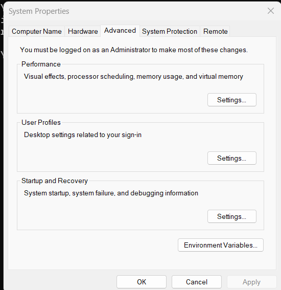

*Hình 1. Mở phần Environment Variables trong System Properties.*

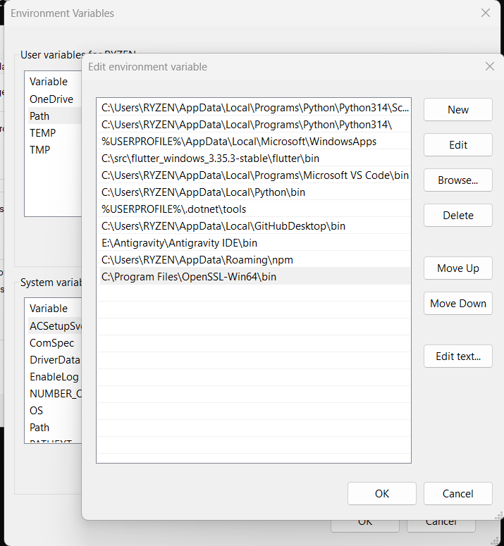

*Hình 2. Thêm đường dẫn thư mục `bin` của OpenSSL vào `Path`.*

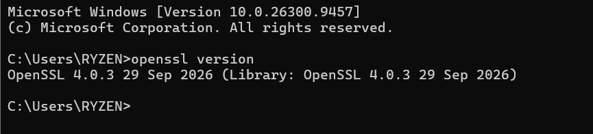

*Hình 3. OpenSSL đã được nhận diện từ Command Prompt.*

#### Bước 2: Tạo CA, server certificate và client certificate

File `openssl.cnf` khai báo thông tin CA. File `make-certs.bat` lần lượt tạo:

- CA private key và CA certificate tự ký;
- server private key, CSR và certificate do CA ký;
- client private key, CSR và certificate do CA ký.

Chạy script trong thư mục `secure-chat`:

```powershell
cd secure-chat
.\make-certs.bat
```

Trong môi trường thực hành, script dùng đường dẫn tuyệt đối tới `openssl.exe` để vẫn chạy được khi terminal của VS Code chưa nhận biến `Path` mới.

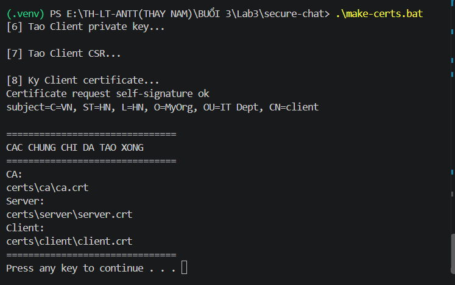

*Hình 4. CA, server certificate và client certificate được tạo thành công.*

#### Bước 3: Xác minh chứng chỉ bằng CA

```powershell
& "C:\Program Files\OpenSSL-Win64\bin\openssl.exe" verify `
  -CAfile certs\ca\ca.crt certs\server\server.crt

& "C:\Program Files\OpenSSL-Win64\bin\openssl.exe" verify `
  -CAfile certs\ca\ca.crt certs\client\client.crt
```

Kết quả mong đợi cho cả hai lệnh là `OK`.

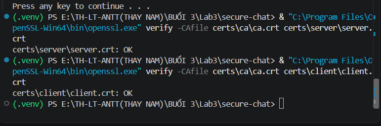

*Hình 5. Hai chứng chỉ đều được CA xác minh thành công.*

Có thể xem chi tiết chứng chỉ server bằng lệnh:

```powershell
& "C:\Program Files\OpenSSL-Win64\bin\openssl.exe" x509 `
  -in certs\server\server.crt -text -noout
```

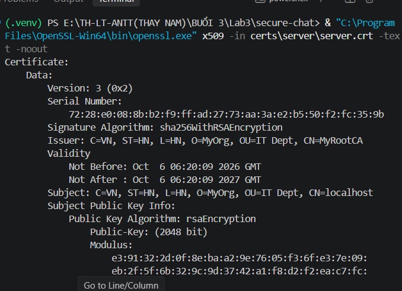

*Hình 6. Server certificate dùng RSA 2048 bit, do `MyRootCA` phát hành cho `localhost`.*

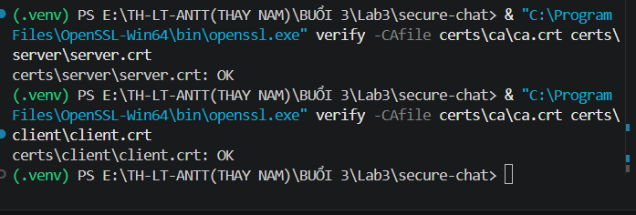

*Hình 7. Kết quả xác minh lại server certificate và client certificate đều là `OK`.*

#### Bước 4: Kiểm thử module mã hóa AES

Cài thư viện cần thiết nếu môi trường chưa có:

```powershell
pip install cryptography
```

Thử mã hóa và giải mã chuỗi `Hello Lab 3` bằng lớp `MessageEncryption`.

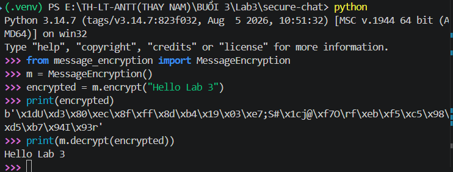

*Hình 8. Dữ liệu mã hóa ở dạng byte và được giải mã đúng về nội dung ban đầu.*

#### Bước 5: Chạy server và hai client

Mở ba terminal trong thư mục `secure-chat`.

Terminal 1:

```powershell
python server.py
```

Terminal 2 và 3:

```powershell
python client.py
```

Nhập lần lượt username `tham` và `user2` để kiểm thử gửi/nhận tin nhắn.

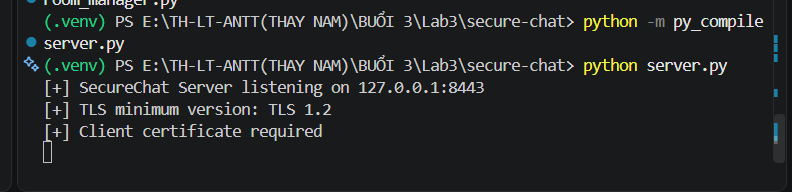

*Hình 9. Server lắng nghe tại `127.0.0.1:8443`, yêu cầu TLS 1.2 trở lên và client certificate.*

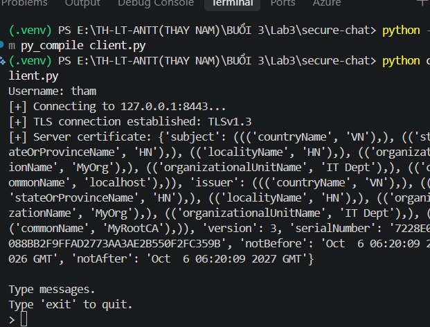

*Hình 10. Client `tham` thiết lập TLS 1.3 và nhận thông tin chứng chỉ server.*

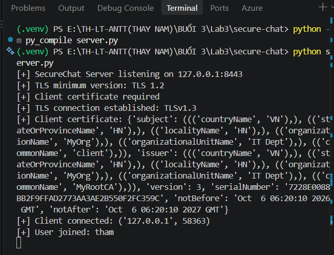

*Hình 11. Server xác thực chứng chỉ client và ghi nhận người dùng `tham` tham gia.*

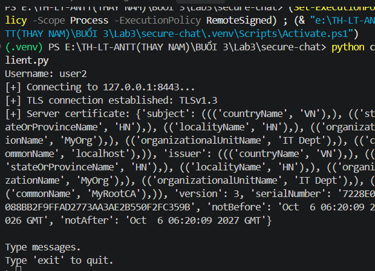

*Hình 12. Client `user2` cũng thiết lập kết nối TLS 1.3 thành công.*

### 3.3. Kết quả kiểm thử

Client `tham` gửi tin nhắn `Xin chao user2`; client `user2` nhận đúng nội dung. Sau đó `user2` gửi lại `Xin chao Tham` và client còn lại nhận thành công.

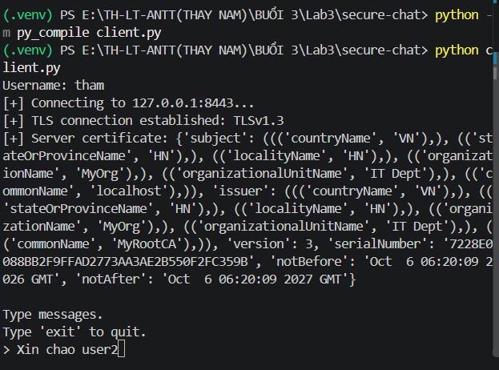

*Hình 13. Client `tham` gửi tin nhắn cho `user2`.*

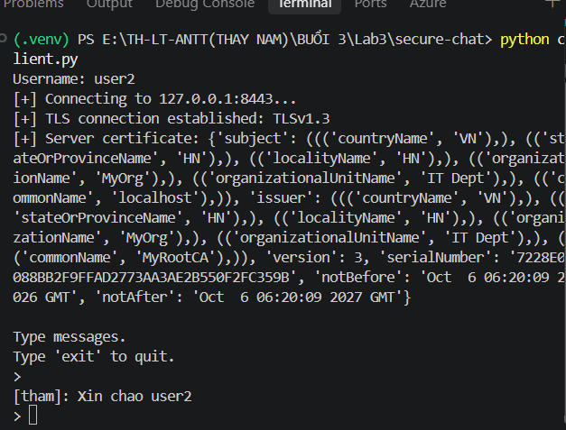

*Hình 14. Client `user2` nhận đúng tin nhắn từ `tham`.*

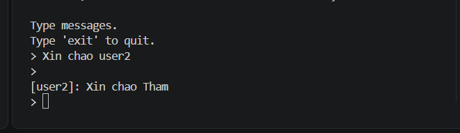

*Hình 15. `user2` gửi phản hồi và client `tham` nhận được nội dung.*

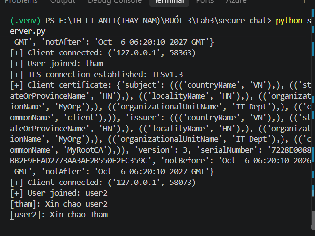

*Hình 16. Server ghi nhận hai client kết nối và chuyển tiếp tin nhắn hai chiều.*

Kết quả cho thấy kết nối mTLS, mã hóa AES và cơ chế chuyển tiếp tin nhắn giữa hai client đều hoạt động đúng trong phạm vi bài lab.

---

## 4. Phần 2 - NetRecon

### 4.1. Mục tiêu và thành phần

NetRecon được viết bằng Python và Flask, gồm các module:

| Module | Chức năng |
| --- | --- |
| `banner_grabber.py` | Kết nối TCP, chờ tối đa 2 giây và đọc tối đa 1024 byte banner. |
| `email_sender.py` | Gửi kết quả qua Gmail SMTP sử dụng SSL tại cổng 465. |
| `filter_utils.py` | Lọc danh sách IP theo whitelist/blacklist; đã kiểm thử độc lập. |
| `network_mapper.py` | Chạy `arp -a` để lấy danh sách thiết bị đã biết trong mạng cục bộ. |
| `port_scanner.py` | Quét TCP bất đồng bộ, giới hạn số kết nối đồng thời bằng semaphore. |
| `service_detector.py` | Gọi Nmap với `-sT -sV --version-light` để nhận dạng dịch vụ. |
| `vuln_checker.py` | Đối chiếu cổng với bảng CVE mẫu có sẵn; không thực hiện khai thác lỗ hổng. |

`cli.py` cung cấp giao diện dòng lệnh. `app.py` cung cấp giao diện Flask tại `http://127.0.0.1:5000`.

### 4.2. Các bước thực hiện

#### Bước 1: Cài Nmap và thư viện Python

Npcap gặp lỗi cài đặt `0x8007007e`, nhưng Nmap vẫn được cài và tự chuyển sang chế độ TCP `connect()`. Đây cũng là kỹ thuật mà module Service Detection chủ động dùng qua tùy chọn `-sT`.

Tạo môi trường ảo, kích hoạt và cài các gói:

```powershell
cd netrecon
python -m venv .venv
.\.venv\Scripts\Activate.ps1
pip install -r requirements.txt
```

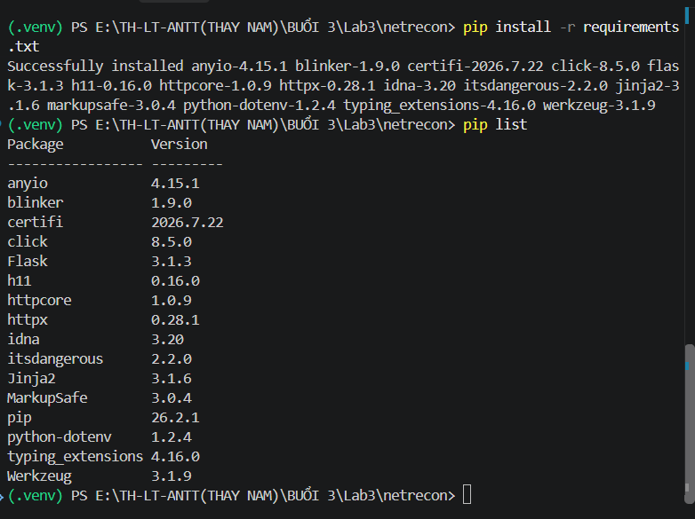

*Hình 17. Flask, Click, HTTPX, python-dotenv và các gói phụ thuộc được cài thành công.*

#### Bước 2: Kiểm thử từng module

Banner Grabbing được thử với cổng 443. Kết nối thành công nhưng dịch vụ không chủ động trả banner trong thời gian chờ.

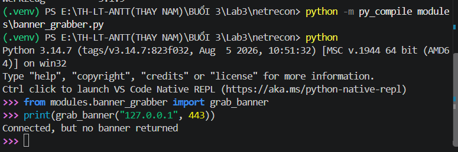

*Hình 18. Kết nối tới cổng 443 thành công nhưng không nhận được banner.*

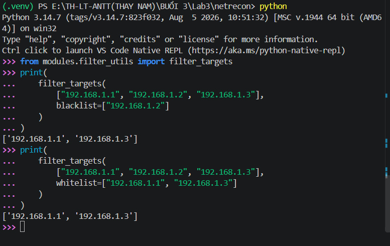

*Hình 19. `filter_targets` loại đúng IP trong blacklist và chỉ giữ IP thuộc whitelist.*

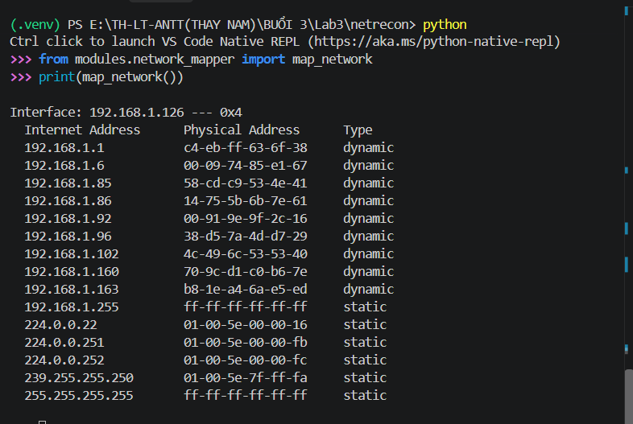

*Hình 20. Network Mapper đọc bảng ARP và liệt kê địa chỉ IP, MAC cùng kiểu bản ghi.*

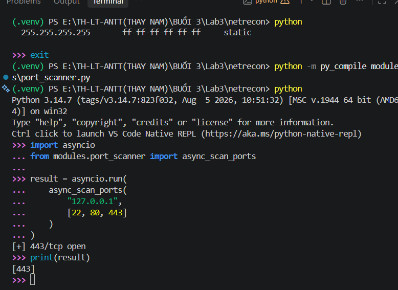

*Hình 21. Port Scanner phát hiện cổng 443 đang mở trên máy cục bộ.*

Để tạo dịch vụ kiểm thử tại cổng 8000, mở một terminal riêng:

```powershell
python -m http.server 8000
```

Sau đó quét cổng và nhận dạng dịch vụ:

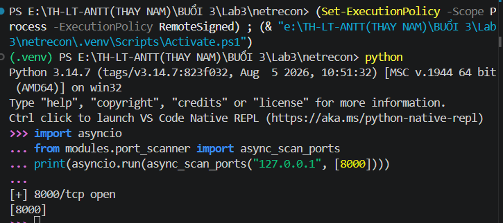

*Hình 22. Port Scanner phát hiện cổng 8000 đang mở.*

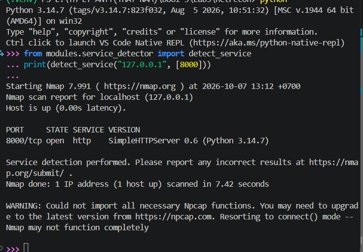

*Hình 23. Nmap nhận dạng `8000/tcp open http SimpleHTTPServer 0.6 (Python 3.14.7)` và thông báo chuyển sang `connect()` mode.*

`service_detector.py` dùng đường dẫn tuyệt đối `C:\Program Files (x86)\Nmap\nmap.exe` do terminal VS Code chưa nhận Nmap trong `Path`. Lệnh còn có timeout 60 giây để tránh giao diện chờ vô hạn.

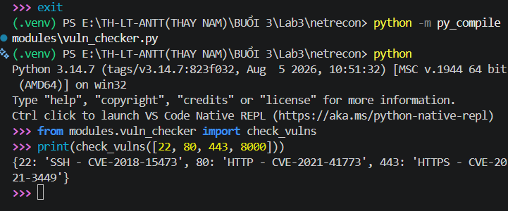

*Hình 24. Module trả về các CVE mẫu tương ứng với cổng 22, 80 và 443; cổng 8000 không có trong bảng ánh xạ.*

#### Bước 3: Cấu hình gửi email an toàn

Cấu hình tài khoản gửi và khóa xác thực SMTP được đọc từ file `.env`; file này đã nằm trong `.gitignore`. App Password chỉ được dùng khi kiểm thử và đã được thu hồi sau khi hoàn thành.

Địa chỉ email kiểm thử trong các ảnh minh họa đã được che một phần: vẫn đủ làm minh chứng sinh viên đã thực hiện bài lab nhưng hạn chế công khai thông tin cá nhân. Tuyệt đối không ghi hoặc để lộ mật khẩu, App Password, giá trị `SMTP_PASS`, mã 2FA, token hay bất kỳ thông tin xác thực nào khác.

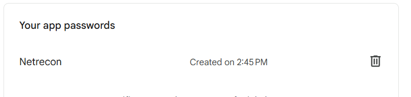

*Hình 25. Mục App Password `Netrecon` đã được tạo để phục vụ kiểm thử; ảnh không hiển thị giá trị bí mật.*

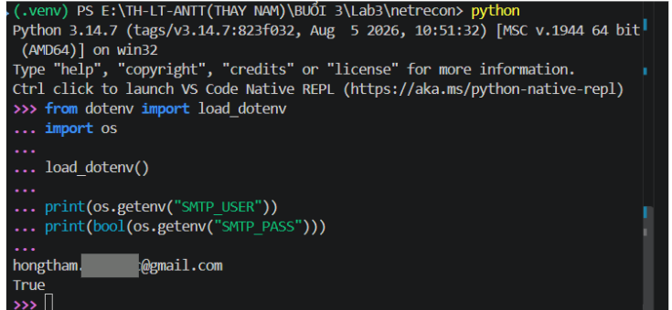

*Hình 26. Kiểm tra file môi trường: tài khoản SMTP đã được nạp, khóa xác thực tồn tại (`True`), địa chỉ email được che một phần và giá trị bí mật không được hiển thị.*

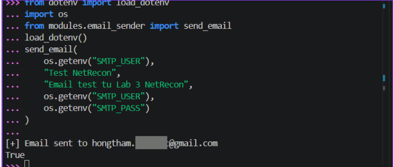

*Hình 27. Gọi trực tiếp hàm `send_email` và nhận kết quả `True`; địa chỉ nhận trong thông báo thành công đã được che một phần.*

Kết quả thực hành xác nhận SMTP gửi email thành công. Sau kiểm thử, App Password đã được xóa/thu hồi.

#### Bước 4: Kiểm thử bằng CLI

Ví dụ quét cổng:

```powershell
python cli.py --target 127.0.0.1 --ports 22,80,443 --mode scan
```

Ví dụ nhận dạng dịch vụ cổng 8000:

```powershell
python cli.py --target 127.0.0.1 --ports 8000 --mode service
```

Các mode được hỗ trợ gồm `scan`, `service`, `banner`, `map`, `vuln` và `all`. Tham số `--rate-limit` điều chỉnh số tác vụ quét đồng thời.

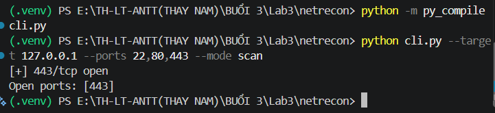

*Hình 28. CLI phát hiện cổng 443 mở trong danh sách 22, 80 và 443.*

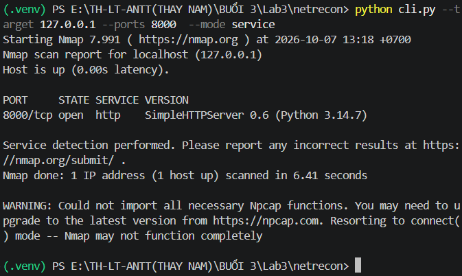

*Hình 29. CLI nhận dạng Python SimpleHTTPServer tại cổng 8000.*

#### Bước 5: Chạy giao diện web Flask

```powershell
python app.py
```

Truy cập `http://127.0.0.1:5000` trên trình duyệt.

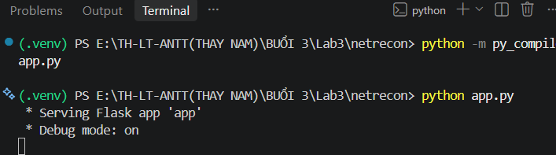

*Hình 30. Flask khởi động ở chế độ debug.*

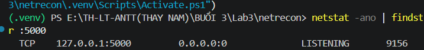

*Hình 31. `netstat` xác nhận ứng dụng đang lắng nghe tại `127.0.0.1:5000`.*

### 4.3. Kết quả kiểm thử giao diện web

#### Port Scan

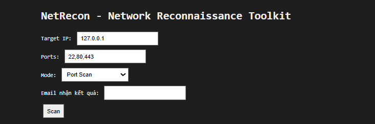

*Hình 32. Chọn chế độ Port Scan với target `127.0.0.1` và các cổng 22, 80, 443.*

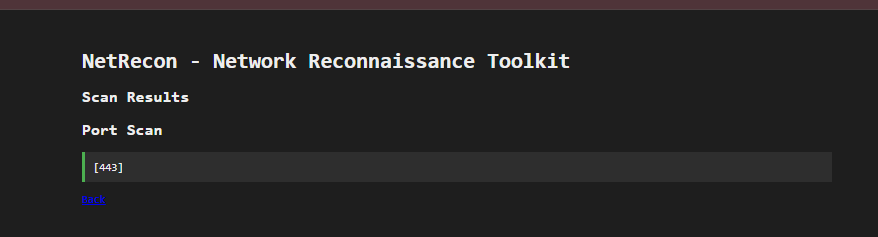

*Hình 33. Giao diện web trả về cổng 443 đang mở.*

#### Service Detection

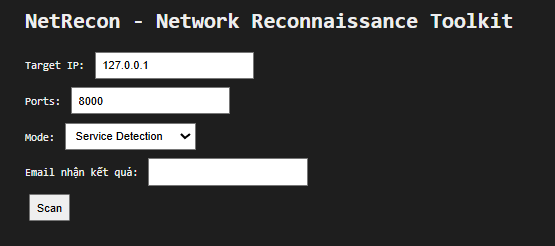

*Hình 34. Chọn Service Detection cho cổng 8000.*

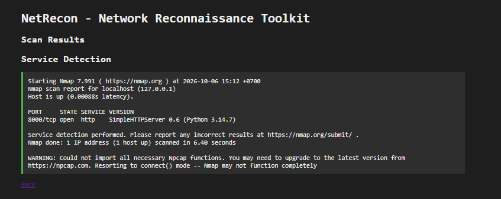

*Hình 35. Nmap nhận dạng SimpleHTTPServer 0.6 trên Python 3.14.7 và hiển thị cảnh báo Npcap.*

#### Banner Grabbing

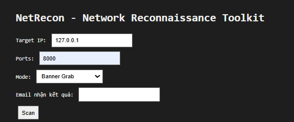

*Hình 36. Chọn Banner Grab cho dịch vụ tại cổng 8000.*

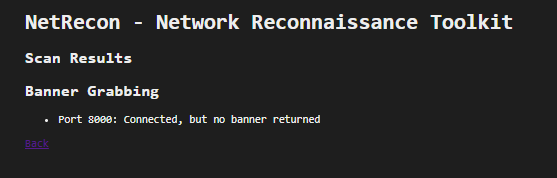

*Hình 37. Kết nối cổng 8000 thành công nhưng Python HTTP Server không tự gửi banner khi chưa có HTTP request.*

#### Network Map

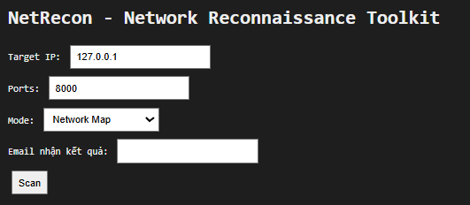

*Hình 38. Chọn chế độ Network Map trên giao diện Flask.*

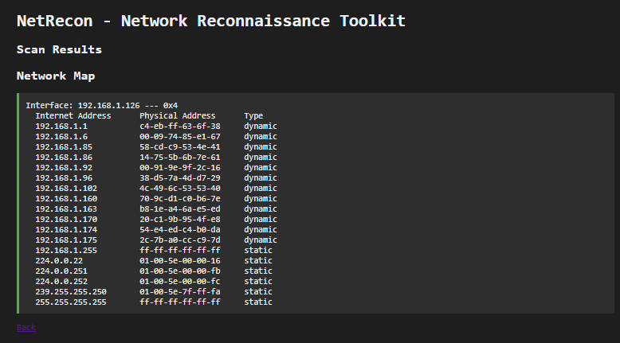

*Hình 39. Bảng ARP được hiển thị trên trang kết quả.*

#### Vulnerability Check

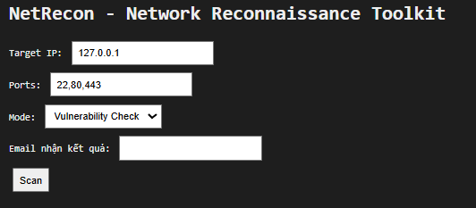

*Hình 40. Chọn Vulnerability Check cho các cổng 22, 80 và 443.*

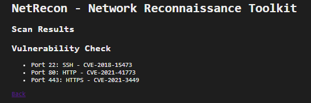

*Hình 41. Kết quả đối chiếu hiển thị dịch vụ và CVE mẫu tương ứng từng cổng.*

#### Chạy toàn bộ chức năng

Chế độ `All` đã được thử với Python HTTP Server tại cổng 8000. Kết quả tổng hợp gồm Port Scan, Service Detection, Banner Grabbing và Network Map; phần Vulnerability Check không hiển thị mục nào vì cổng 8000 không nằm trong bảng `VULN_PORTS`.

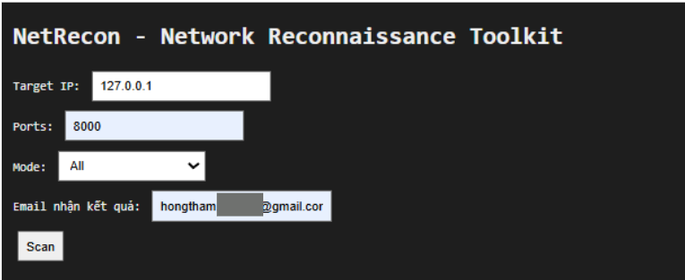

*Hình 42. Gửi yêu cầu chạy chế độ `All` cho `127.0.0.1:8000`; phần nhận diện trong địa chỉ email nhận kết quả đã được che.*

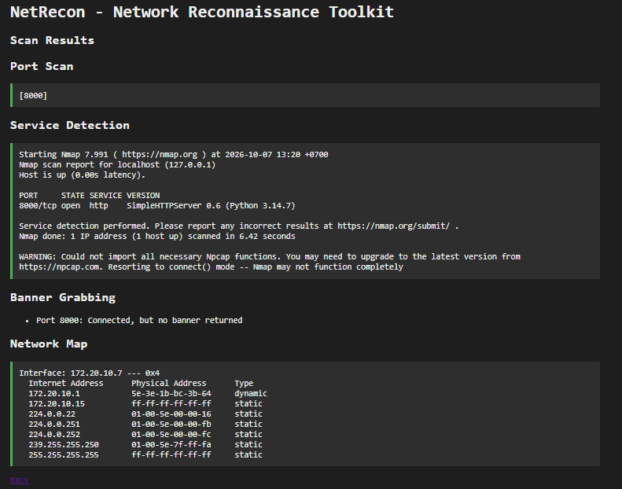

*Hình 43. Trang kết quả tổng hợp cho cổng 8000, gồm cổng mở, dịch vụ, banner và bảng ARP.*

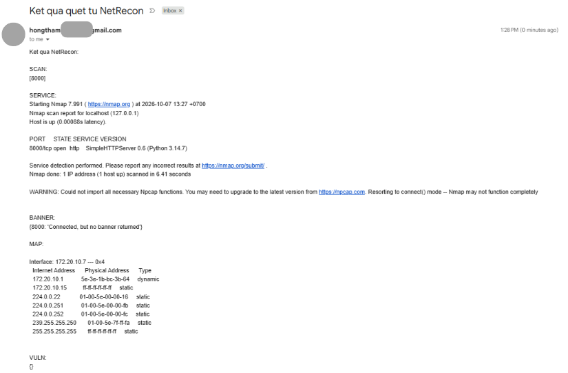

*Hình 44. Gmail nhận được báo cáo đầy đủ gồm Port Scan, Service Detection, Banner Grabbing, Network Map và mục Vulnerability Check; địa chỉ người gửi đã được che một phần.*

---

## 5. Các lỗi gặp phải và cách xử lý

| Vấn đề | Cách xử lý |
| --- | --- |
| OpenSSL hoặc Nmap chưa được nhận trong terminal VS Code | Thêm thư mục chương trình vào `Path`; trong quá trình thực hành dùng đường dẫn tuyệt đối tới `openssl.exe` và `nmap.exe`. |
| Các option TLS cũ có cảnh báo deprecated | Dùng `context.minimum_version = ssl.TLSVersion.TLSv1_2`. Phiên thực tế thương lượng TLS 1.3. |
| Npcap lỗi `0x8007007e` trên Windows | Dùng TCP Connect Scan (`-sT`). Nmap tự fallback sang `connect()` mode; các chức năng cần thiết vẫn hoạt động. |
| Service Detection có thể chạy lâu | Thêm timeout 60 giây cho `subprocess.run`. |
| Python HTTP Server không tự trả banner | Ghi nhận đúng trạng thái `Connected, but no banner returned`; đây không phải lỗi kết nối. |
| Nguy cơ lộ thông tin SMTP | Đọc cấu hình từ `.env`, đưa `.env` vào `.gitignore`, không ghi bí mật trong code/README và thu hồi App Password sau kiểm thử. |

Trong môi trường lab, client tắt kiểm tra hostname (`check_hostname = False`) để dùng chứng chỉ `localhost` khi kết nối tới `127.0.0.1`. Khi triển khai thực tế cần bật kiểm tra hostname, dùng chứng chỉ có SAN phù hợp và bảo vệ chặt các private key.

## 6. Kết luận

Lab 3 đã hoàn thành hai phần theo yêu cầu:

- SecureChat tạo và xác minh đầy đủ CA, server certificate, client certificate; thiết lập kết nối xác thực hai chiều bằng TLS 1.3 trong lần kiểm thử; mã hóa tin nhắn bằng AES và trao đổi thành công giữa `tham` với `user2`.
- NetRecon hoạt động qua CLI và web Flask, kiểm thử thành công Port Scan, Service Detection, Banner Grabbing, Network Map, Vulnerability Check và gửi kết quả qua Gmail SMTP. Nmap vẫn đáp ứng yêu cầu bài lab dù Npcap lỗi và phải dùng `connect()` mode.

Qua bài thực hành có thể thấy TLS/chứng chỉ số bảo vệ kênh liên lạc, còn các kỹ thuật quét cổng và nhận dạng dịch vụ hỗ trợ thu thập thông tin ban đầu khi đánh giá an toàn mạng.
