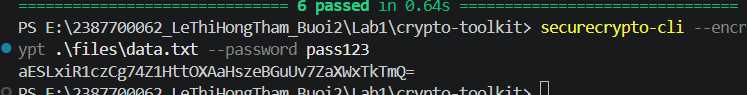
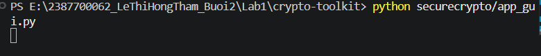
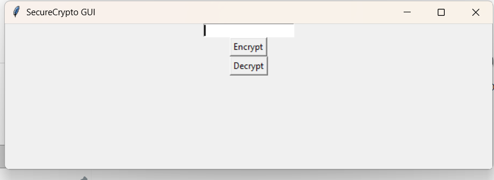
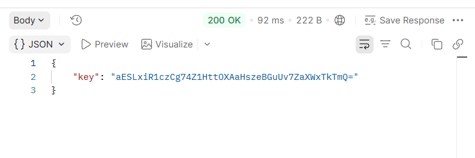
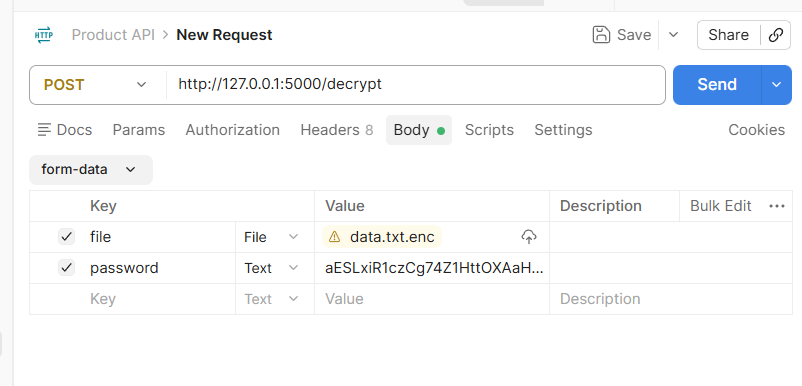
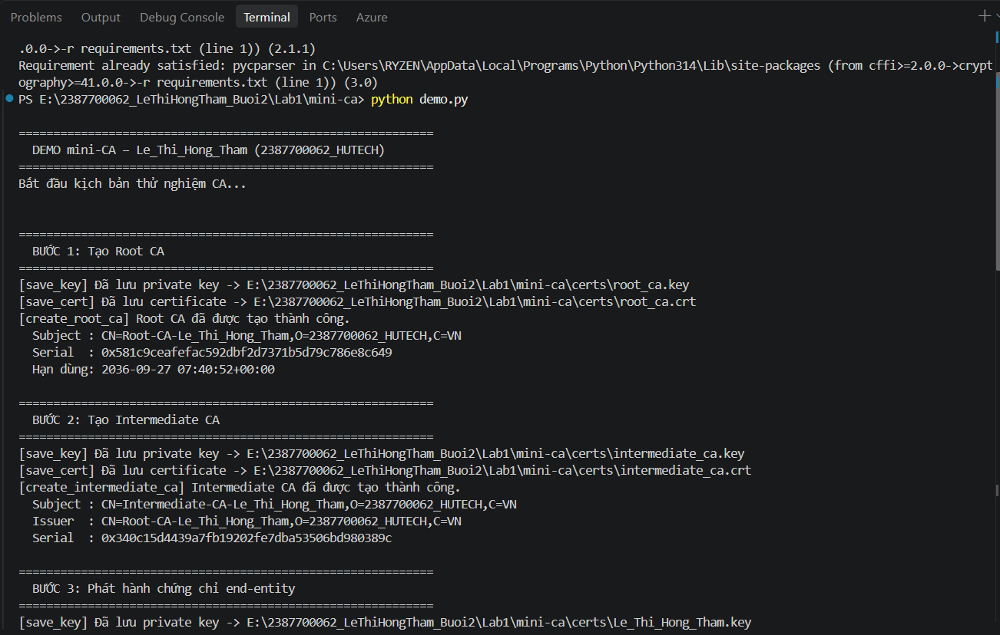
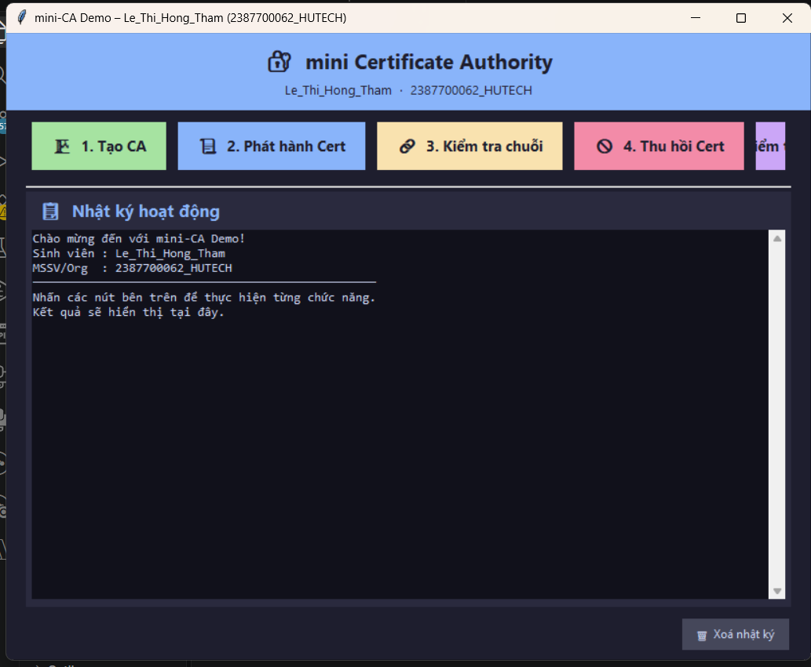
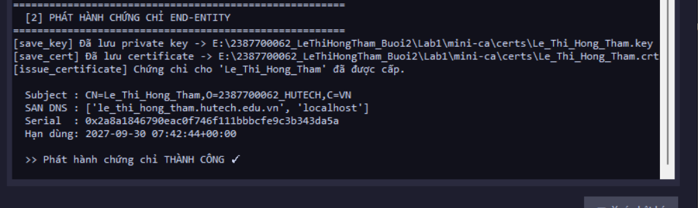
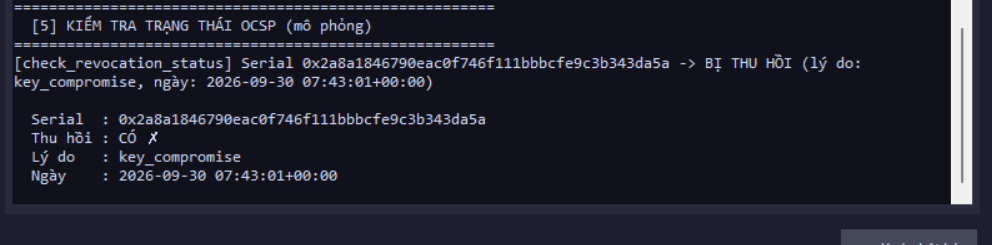

# BÁO CÁO THỰC HÀNH BUỔI 2: MÃ HOÁ VÀ TRIỂN KHAI PKI

| Thông tin | Chi tiết |
|-----------|----------|
| **Họ và tên** | Lê Thị Hồng Thắm |
| **MSSV** | 2387700062 |
| **Lớp** | 23DATA1 |
| **Trường** | Đại học Công nghệ TP.HCM (HUTECH) |
| **Ngày thực hành** | 30/09/2026 |

---

## PHẦN 1: THỰC HÀNH CRYPTOTOOLKIT — XÂY DỰNG THƯ VIỆN MẬT MÃ

### 1. Mục tiêu

Xây dựng thư viện mật mã `securecrypto` hoàn chỉnh hỗ trợ các tính năng:

- Mã hóa và giải mã file an toàn bằng thuật toán đối xứng **AES-256-GCM**.
- Băm mật khẩu bảo mật cao sử dụng **Argon2**.
- Khởi tạo cặp khóa, ký số và xác thực chữ ký dữ liệu bằng hệ mật mã bất đối xứng **RSA**.
- Tích hợp các chức năng trên vào **giao diện dòng lệnh (CLI)**, **giao diện đồ họa (GUI)** và **ứng dụng web API** bằng Flask.

---

### 2. Minh chứng thực hành

#### 2.1. Vượt qua các bài kiểm thử đơn vị (Unit Tests)

Chạy lệnh `pytest tests/` trong thư mục dự án `crypto-toolkit`. Toàn bộ **6 test case** trên ba module:
- `tests/test_aes_utils.py` — kiểm thử AES-256-GCM
- `tests/test_hash_utils.py` — kiểm thử Argon2 password hashing
- `tests/test_rsa_utils.py` — kiểm thử sinh khóa và ký số RSA

đều được thực thi thành công, đạt kết quả **6 passed in 0.64s** trên môi trường Python 3.14.7, pytest-9.1.1, pluggy-1.6.0.


---

#### 2.2. Mã hóa và giải mã bằng giao diện dòng lệnh (CLI)

**Mã hóa (Encrypt):**  
Sử dụng công cụ `securecrypto-cli` với tham số `--encrypt` để mã hóa file `.\files\data.txt` bằng mật khẩu `pass123`. Hệ thống trả về chuỗi **key Base64** xác nhận mã hóa thành công:

```
aESLxiR1czCg74Z1HttOXAaHszeBGuUv7ZaXWxTkTmQ=
```



**Giải mã (Decrypt):**  
Tiếp tục dùng `--decrypt` truyền vào `.\files\data.txt.enc` và key Base64 vừa nhận được. Hệ thống phản hồi:

```
Decrypted. Output: .\files\data.txt.dec
```

Xác nhận file gốc được khôi phục thành công tại `data.txt.dec`.


---

#### 2.3. Mã hóa và giải mã bằng giao diện đồ họa (GUI)

Thực thi lệnh `python securecrypto/app_gui.py`. Ứng dụng **SecureCrypto GUI** khởi động thành công, hiển thị cửa sổ tkinter với ô nhập mật khẩu và hai nút thao tác **Encrypt** / **Decrypt** để thực hiện trực quan.




---

#### 2.4. Khai thác tính năng qua Flask API (Postman)

**Khởi động Flask Server:**  
Chạy lệnh `python securecrypto/api.py`. Server lắng nghe tại `http://127.0.0.1:5000` và log ghi nhận:

```
POST /encrypt HTTP/1.1  200
```


**Gọi API Encrypt:**  
Gửi request **POST** tới `http://127.0.0.1:5000/encrypt` dạng `form-data` với `file = data.txt` và `password = pass123`. Hệ thống phản hồi **200 OK** (92ms) kèm JSON:

```json
{
  "key": "aESLxiR1czCg74Z1HttOXAaHszeBGuUv7ZaXWxTkTmQ="
}
```




**Gọi API Decrypt:**  
Gửi request **POST** tới `http://127.0.0.1:5000/decrypt` với `file = data.txt.enc` và `password` là chuỗi key Base64. Phản hồi **200 OK** (13ms):

```json
{
  "output": "E:\\...\\securecrypto\\upload\\data.txt.dec"
}
```




---

## PHẦN 2: THỰC HÀNH CERTIFICATE AUTHORITY (MINI-CA)

### 1. Mục tiêu

Triển khai hạ tầng khóa công khai (PKI) thu nhỏ để quản lý vòng đời chứng chỉ số:

- Khởi tạo chứng chỉ **Root CA** tự ký (self-signed) và **Intermediate CA**.
- Phát hành chứng chỉ số định dạng **X.509** cho End-entity (người dùng cuối).
- Kiểm tra tính toàn vẹn của **chuỗi chứng chỉ** (Chain of Trust).
- **Thu hồi chứng chỉ** (Revoke) và cập nhật danh sách thu hồi **CRL**, kiểm tra trạng thái trực tuyến **OCSP**.

---

### 2. Minh chứng thực hành

#### 2.1. Quản lý CA qua kịch bản dòng lệnh (`demo.py`) — Bước 1 & 2

Chạy lệnh `python demo.py`. Script thực thi tuần tự từng bước:

**Bước 1 — Tạo Root CA:**
```
Subject : CN=Root-CA-Le_Thi_Hong_Tham,O=2387700062_HUTECH,C=VN
Serial  : 0x581c9ceafefac592dbf2d7371b5d79c786e8c649
Hạn dùng: 2036-09-27 07:40:52+00:00
```
File lưu: `certs/root_ca.key` và `certs/root_ca.crt`.

**Bước 2 — Tạo Intermediate CA:**
```
Subject : CN=Intermediate-CA-Le_Thi_Hong_Tham,O=2387700062_HUTECH,C=VN
Issuer  : CN=Root-CA-Le_Thi_Hong_Tham,O=2387700062_HUTECH,C=VN
Serial  : 0x340c15d4439a7fb19202fe7dba53506bd980389c
```
File lưu: `certs/intermediate_ca.key` và `certs/intermediate_ca.crt`.



---

#### 2.2. Kịch bản dòng lệnh — Bước 3, 4 & 5

**Bước 3 — Phát hành chứng chỉ End-entity cho Lê Thị Hồng Thắm:**
```
Subject : CN=Le_Thi_Hong_Tham,O=2387700062_HUTECH,C=VN
SAN DNS : ['le_thi_hong_tham.hutech.edu.vn', 'localhost']
Serial  : 0x3d9acbb7127cc67754a5c75cbe86fe9e161cb551
```

**Bước 4 — Xác minh chuỗi tin cậy (Chain of Trust):**
```
[verify] entity_cert   <- intermediate_ca : HỢP LỆ ✓
[verify] intermediate_ca <- root_ca       : HỢP LỆ ✓
[verify] root_ca (self-signed)            : HỢP LỆ ✓
>> Kết quả: CHUỖI HỢP LỆ ✓
```

**Bước 5 — Quản lý thu hồi (CRL):**
- `[5b]` Trước thu hồi: `CHƯA bị thu hồi ✓`
- `[5c]` Thu hồi lý do `key_compromise` → cập nhật `certs/crl.pem`
- `[5d]` Sau thu hồi: `BỊ THU HỒI — lý do: key_compromise, ngày: 2026-09-30 07:40:52+00:00`

**Hoàn thành:** Tất cả các bước thành công!


---

#### 2.3. Thao tác trên giao diện Mini-CA (`demo_ui.py`) — Khởi động

Chạy lệnh `python demo_ui.py`, ứng dụng tkinter **mini Certificate Authority** khởi động với:
- Tiêu đề: `mini-CA Demo – Le_Thi_Hong_Tham (2387700062_HUTECH)`
- 5 nút chức năng: **Tạo CA · Phát hành Cert · Kiểm tra chuỗi · Thu hồi Cert · Kiểm tra OCSP**
- Khu vực **Nhật ký hoạt động** hiển thị log real-time phía dưới



---

#### 2.4. GUI — Tạo Root CA & Intermediate CA

Nhấn nút **1. Tạo CA**, nhật ký ghi nhận đồng thời:
```
[create_root_ca]         Root CA đã được tạo thành công.
Root CA serial   : 0x17ef57362e3955702ff8716982cd694bbf84184a
[create_intermediate_ca] Intermediate CA đã được tạo thành công.
Inter CA serial  : 0xf4d91c0e524b771adddad67bb2b863ff37c343d
>> Tạo CA THÀNH CÔNG ✓
```


---

#### 2.5. GUI — Phát hành chứng chỉ End-entity

Nhấn nút **2. Phát hành Cert**, hệ thống phát hành chứng chỉ X.509 cho `Le_Thi_Hong_Tham`:
```
Subject : CN=Le_Thi_Hong_Tham,O=2387700062_HUTECH,C=VN
SAN DNS : ['le_thi_hong_tham.hutech.edu.vn', 'localhost']
Serial  : 0x2a8a1846790eac0f746f111bbbcfe9c3b343da5a
Hạn dùng: 2027-09-30 07:42:44+00:00
>> Phát hành chứng chỉ THÀNH CÔNG ✓
```



---

#### 2.6. GUI — Kiểm tra chuỗi chứng chỉ

Nhấn nút **3. Kiểm tra chuỗi**, kết quả xác minh toàn bộ chuỗi 3 tầng:
```
[verify] entity_cert   <- intermediate_ca : HỢP LỆ ✓
[verify] intermediate_ca <- root_ca       : HỢP LỆ ✓
[verify] root_ca (self-signed)            : HỢP LỆ ✓
>> Chuỗi chứng chỉ HỢP LỆ ✓
```


---

#### 2.7. GUI — Thu hồi chứng chỉ (CRL)

Nhấn nút **4. Thu hồi Cert**, hệ thống cập nhật danh sách CRL:
```
[revoke_certificate] Đã thu hồi serial=24285722988... (lý do: key_compromise)
-> certs/crl.pem
Serial bị thu hồi : 0x2a8a1846790eac0f746f111bbbcfe9c3b343da5a
Lý do             : key_compromise
>> Thu hồi chứng chỉ THÀNH CÔNG ✓
```


---

#### 2.8. GUI — Kiểm tra trạng thái OCSP (mô phỏng)

Nhấn nút **5. Kiểm tra OCSP**, hệ thống truy vấn CRL và phản hồi:
```
Serial  : 0x2a8a1846790eac0f746f111bbbcfe9c3b343da5a
Thu hồi : CÓ ✗
Lý do   : key_compromise
Ngày    : 2026-09-30 07:43:01+00:00
```

Xác nhận chứng chỉ đã bị thu hồi và không còn hợp lệ.



---

## Tổng kết

| Phần | Nội dung | Kết quả |
|------|----------|---------|
| **Lab 1** | Unit Test (AES-256-GCM, Argon2, RSA) | ✅ 6/6 passed |
| **Lab 1** | CLI Encrypt / Decrypt | ✅ Thành công |
| **Lab 1** | GUI SecureCrypto (tkinter) | ✅ Khởi động OK |
| **Lab 1** | Flask API `/encrypt` | ✅ HTTP 200 + key Base64 |
| **Lab 1** | Flask API `/decrypt` | ✅ HTTP 200 + file giải mã |
| **Lab 2** | Tạo Root CA & Intermediate CA | ✅ Thành công |
| **Lab 2** | Phát hành chứng chỉ X.509 | ✅ CN=Le_Thi_Hong_Tham |
| **Lab 2** | Xác minh chuỗi (Chain of Trust) | ✅ 3/3 tầng hợp lệ |
| **Lab 2** | Thu hồi CRL (key_compromise) | ✅ crl.pem cập nhật |
| **Lab 2** | Kiểm tra OCSP | ✅ Phát hiện đúng trạng thái Revoked |

> Bài thực hành đã được hoàn thành trọn vẹn, đáp ứng toàn bộ các yêu cầu về mã hóa dữ liệu hiện đại và nắm vững quy trình vận hành hệ thống cấp phát, quản lý chứng chỉ số PKI thực tế.
