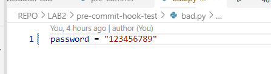
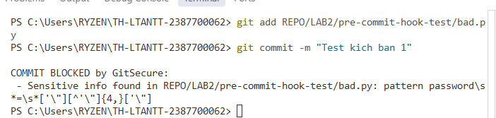
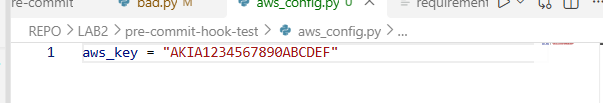
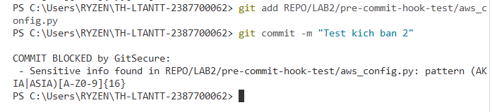
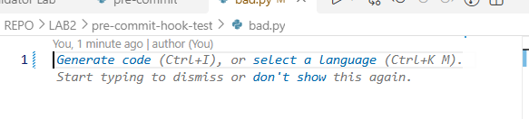
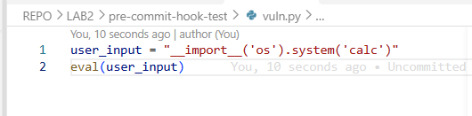
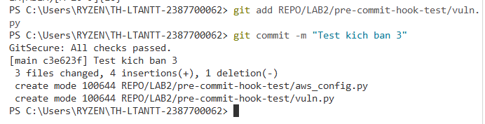
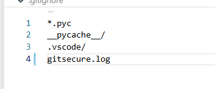
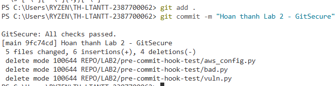

# Lab 02 – Git Pre-commit Security Hook (GitSecure)

**Sinh viên:** Lê Thị Hồng Thắm — **MSSV:** 2387700062  
**Trường:** Trường Đại học Công Nghệ Tp.HCM - HUTECH  
**Lớp:** 23DATA1 — **Buổi:** 1 — **Phạm vi:** Mục 1.4 & 1.5 (Xây dựng và Kiểm thử hệ thống GitSecure).

---

## 1. Mục tiêu
* Hiểu và áp dụng tự động hóa bảo mật (Shift-left security) trong quy trình quản lý mã nguồn.
* Xây dựng hệ thống `GitSecure` bằng Python (chạy dưới dạng pre-commit hook) để tự động quét mã nguồn trước khi `git commit`.
* Ngăn chặn rò rỉ thông tin nhạy cảm (mật khẩu, API key, token...) và cấu hình quyền file không an toàn lọt vào repository.
* Ứng dụng công cụ `bandit` để phân tích tĩnh (SAST) mã nguồn Python.

---

## 2. Cấu trúc thư mục

```text
TH-LTANTT-2387700062/
└── REPO/
    └── LAB2/
        ├── .githooks/
        │   └── pre-commit              # Script Python xử lý logic quét bảo mật
        ├── image/                      # Thư mục chứa hình ảnh minh chứng kiểm thử
        │   ├── kb1-1.png, kb1-2.png
        │   ├── kb2-1.png, kb2-2.png, kb2-3.png
        │   ├── kb3-1.png, kb3-2.png
        │   └── kb4-1.png, kb4-2.png
        ├── pre-commit-hook-test/
        │   └── bad.py                  # File chứa lỗi bảo mật để kiểm thử
        ├── requirements-dev.txt        # Chứa thư viện bandit
        └── README.md                   # Báo cáo thực hành Lab 2
```
*(Lưu ý: Các file `.gitignore` và `gitsecure.log` được quản lý ở thư mục gốc của dự án để áp dụng cho toàn bộ repository).*

---

## 3. Triển khai GitSecure (Mục 1.4)

Hệ thống hook `.githooks/pre-commit` được viết bằng Python với các tính năng:
- **Quét Regex**: Phát hiện API key, mật khẩu, token bị hardcode (VD: `password = "123456"`).
- **Quét SAST**: Gọi lệnh `bandit -r .` để phân tích các lỗ hổng bảo mật tiềm ẩn trong code.
- **Kiểm tra quyền**: Quét các file có quyền world-writable (được tuỳ chỉnh bỏ qua trên Windows để tránh false-positive).
- **Ghi Log & Chặn**: Nếu có lỗi, ghi thông tin vào `gitsecure.log`, in ra Terminal và chặn tiến trình bằng `sys.exit(1)`.

Cấu hình kích hoạt hook trên môi trường cục bộ:
```bash
git config core.hooksPath REPO/LAB2/.githooks
```

---

## 4. Kiểm thử và Vận hành (Mục 1.5)

Hệ thống GitSecure được kiểm thử qua 4 kịch bản thực tế để đánh giá toàn diện khả năng rào chắn bảo mật từ lỗi logic mã nguồn đến việc rò rỉ dữ liệu nhạy cảm.

### Kịch bản 1: Bị chặn do rò rỉ mật khẩu (Hardcoded Password)
* **Thao tác:** Tạo file `pre-commit-hook-test/bad.py` và nhập biến thông tin nhạy cảm: `password = "123456789"`. Sau đó chạy lệnh `git add .` và `git commit -m "Test kich ban 1"`.
* **Kết quả:** Tiến trình commit lập tức bị chặn do phát hiện chuỗi khớp với Regex tìm kiếm mật khẩu.
* **Minh chứng:**

  
*Hình: Khởi tạo biến mật khẩu trong file kiểm thử bad.py.*

  
*Hình: Terminal báo lỗi pattern password và chặn commit thành công.*

---

### Kịch bản 2: Bị chặn do lộ khóa dịch vụ đám mây (AWS Access Key)
* **Thao tác:** Tạo file `pre-commit-hook-test/aws_config.py` chứa nội dung: `aws_key = "AKIA1234567890ABCDEF"`. Chạy lệnh `git add .` và thực hiện commit.
* **Kết quả:** Biểu thức chính quy (Regex) của GitSecure nhận diện chuẩn xác định dạng khóa AWS (AKIA kèm 16 ký tự) và chặn đứng tiến trình.
* **Minh chứng:**

  
*Hình: Khởi tạo file chứa AWS Access Key.*

  
*Hình: Terminal báo lỗi nhận diện pattern (AKIA|ASIA) và kích hoạt COMMIT BLOCKED.*

  
*Hình: Lịch sử vi phạm và thông tin cảnh báo được lưu vết chi tiết.*

---

### Kịch bản 3: Bị chặn do chứa mã nguy hiểm (Bandit SAST High Severity)
* **Thao tác:** Tạo file `pre-commit-hook-test/vuln.py` chứa hàm `eval()` rất nguy hiểm trong Python. Chạy lệnh `git add .` và tiến hành commit.
* **Kết quả:** Bandit phân tích tĩnh mã nguồn, phát hiện hàm `eval` thuộc nhóm rủi ro cao (High Severity) và kích hoạt lệnh `sys.exit(1)` để chặn commit.
* **Minh chứng:**

  
*Hình: Viết mã nguồn chứa hàm eval() gây mất an toàn.*

  
*Hình: Bandit SAST phát hiện High severity issue và chặn commit.*

---

### Kịch bản 4: Khắc phục vi phạm và Commit thành công
* **Thao tác:** Tiến hành xóa hoàn toàn 3 file chứa mã độc: `bad.py`, `aws_config.py` và `vuln.py`. Đảm bảo file `.gitignore` ở thư mục gốc có chứa dòng `gitsecure.log`. Chạy lệnh `git add .` và `git commit -m "Hoan thanh Lab 2 - GitSecure"`.
* **Kết quả:** Hệ thống vượt qua toàn bộ khâu kiểm duyệt Regex và Bandit. Terminal thông báo `GitSecure: All checks passed.` và ghi nhận thao tác xóa các file mã độc hợp lệ vào lịch sử Git.
* **Minh chứng:**

  
*Hình: Dọn dẹp các tệp tin chứa mã độc và cấu hình an toàn.*

  
*Hình: Terminal hiển thị GitSecure: All checks passed và commit thành công.*

---

## 5. Kết luận

Thông qua Lab 02, em đã nắm vững quy trình triển khai một chốt chặn bảo mật tự động ngay tại máy cá nhân (local environment). Việc kết hợp Pre-commit hook cùng Regex và công cụ SAST (Bandit) giúp phát hiện sớm các rủi ro bảo mật ngay từ khi lập trình viên thao tác đẩy code. Đây là lớp phòng thủ "Shift-Left" hiệu quả, giúp giảm thiểu tối đa nguy cơ rò rỉ dữ liệu nhạy cảm hoặc mã nguồn kém an toàn lên các kho chứa tập trung như GitHub.
