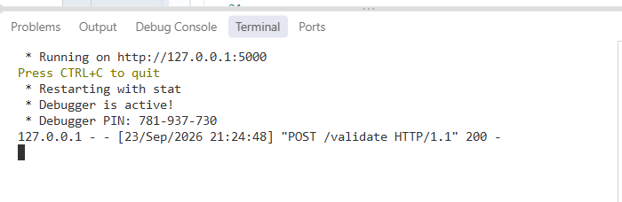
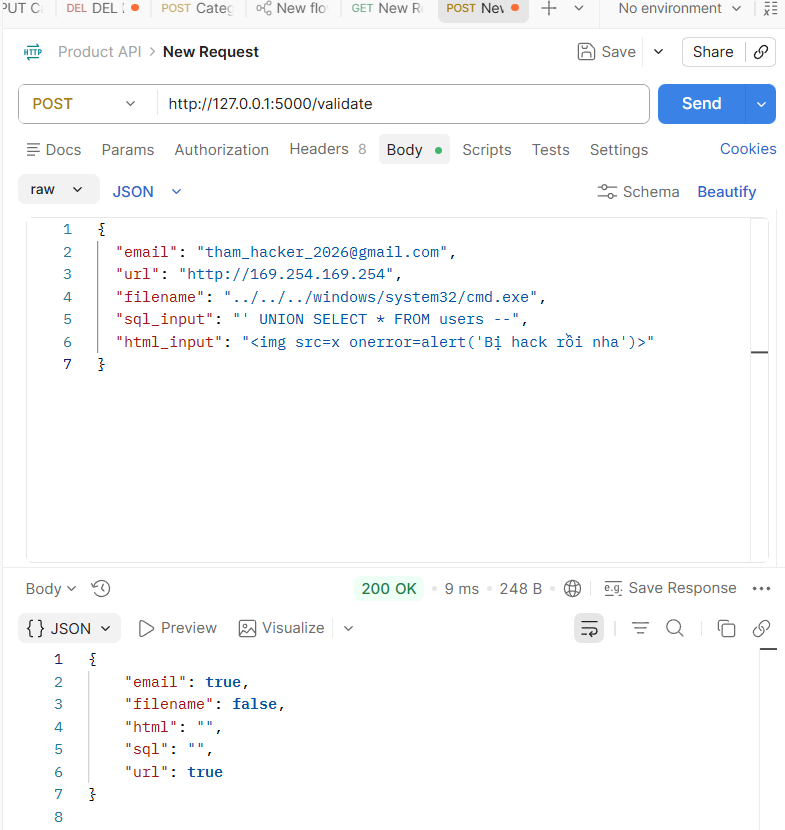
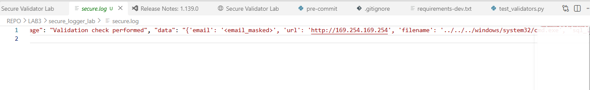

# Lab 03 – Ghi nhật ký ưu tiên bảo mật (SecureLogger)

**Sinh viên:** Lê Thị Hồng Thắm — **MSSV:** 2387700062  
**Trường:** Trường Đại học Công Nghệ Tp.HCM - HUTECH  
**Lớp:** 23DATA1 — **Buổi:** 1 — **Phạm vi:** Mục 1.6 (Hệ thống ghi nhật ký an toàn).

---

## 1. Mục tiêu
* Hiểu rõ tầm quan trọng của việc xử lý lỗi an toàn và bảo mật ghi nhật ký theo tiêu chuẩn OWASP.
* Xây dựng module `SecureLogger` có khả năng tự động phát hiện và che giấu (mask) thông tin cá nhân nhạy cảm (PII) như email, token, số điện thoại trước khi lưu xuống ổ đĩa.
* Triển khai hệ thống API bằng Flask kết hợp thư viện làm sạch dữ liệu (`SecureValidator`) và ghi nhật ký an toàn.

---

## 2. Cấu trúc thư mục

```text
TH-LTANTT-2387700062/
└── REPO/
    └── LAB3/
        ├── image/                      # Thư mục chứa hình ảnh minh chứng kiểm thử
        │   ├── kb1-1.png, kb1-2.png
        │   └── kb2.png
        ├── README.md                   # Báo cáo thực hành Lab 3
        └── secure_logger_lab/
            ├── securevalidator/        # Module làm sạch dữ liệu đầu vào (kế thừa Lab 1)
            │   ├── __init__.py
            │   └── core.py
            ├── securelogger/           # Module xử lý log an toàn (Che PII, Hash chống giả mạo)
            │   ├── __init__.py
            │   └── logger.py
            ├── app.py                  # API Server nhận request và xử lý logic
            ├── requirements.txt        # Thư viện phụ thuộc
            ├── secure.log              # File nhật ký hệ thống đã được làm sạch PII
            └── secure.log.sig          # File lưu trữ mã băm (hash) chống giả mạo log
```

---

## 3. Kiểm thử và Vận hành

Để đánh giá tính hiệu quả của hệ thống, máy chủ API Flask được khởi động tại cổng 5000 và tiếp nhận các yêu cầu kiểm thử thông qua công cụ Postman.

### Kịch bản 1: Gọi API xử lý dữ liệu và kiểm tra kết quả làm sạch (Sanitize)

* **Thao tác:** Sử dụng Postman gửi một HTTP POST request chứa chuỗi JSON độc hại (gồm URL nội bộ, Path Traversal, SQL Injection và XSS) đến endpoint `http://127.0.0.1:5000/validate`.
* **Kết quả:** Máy chủ API tiếp nhận yêu cầu, xử lý qua module `SecureValidator` và trả về mã trạng thái `200 OK`. Dữ liệu phản hồi cho thấy các chuỗi mã độc SQL và HTML đã được vô hiệu hóa hoặc làm sạch hoàn toàn.
* **Minh chứng:**

  
*Hình: Khởi tạo HTTP POST request trên Postman gửi dữ liệu kiểm thử.*

  
*Hình: Phản hồi 200 OK từ API máy chủ với dữ liệu đã được xử lý an toàn.*

---

### Kịch bản 2: Đánh giá khả năng che giấu thông tin cá nhân (PII Masking) trong Log

* **Thao tác:** Kiểm tra nội dung file nhật ký `secure.log` được sinh ra sau khi thực thi Kịch bản 1 để xem thông tin người dùng gửi lên có bị rò rỉ hay không.
* **Kết quả:** Hệ thống `SecureLogger` đã nhận diện thành công dữ liệu nhạy cảm. Trường thông tin địa chỉ email thực tế của người dùng đã bị ghi đè và thay thế bằng chuỗi `<email_masked>` trước khi lưu trữ. Đồng thời mã băm SHA-256 được tính toán và lưu vào `secure.log.sig` để kiểm tra tính toàn vẹn.
* **Minh chứng:**

  
*Hình: Nội dung file secure.log hiển thị thông tin email đã được che giấu bằng chuỗi &lt;email_masked&gt;.*

---

## 4. Kết luận

Qua Lab 03, việc kết hợp giữa kiểm duyệt dữ liệu đầu vào (Input Validation/Sanitization) và ghi nhật ký an toàn (Secure Logging) tạo ra một cơ chế phòng thủ vững chắc cho API. Kỹ thuật Data Masking giúp hệ thống tuân thủ các tiêu chuẩn bảo mật dữ liệu cá nhân (như GDPR) ngay cả khi nhật ký hệ thống vô tình bị rò rỉ.
